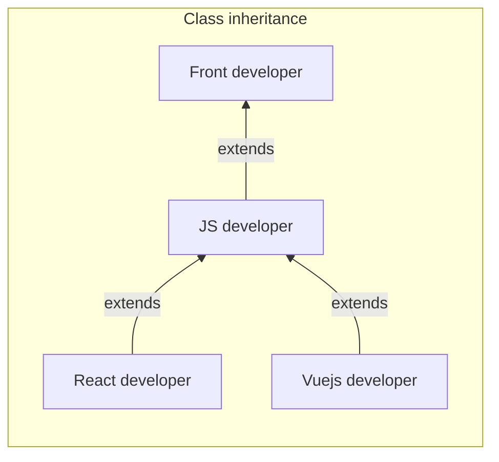
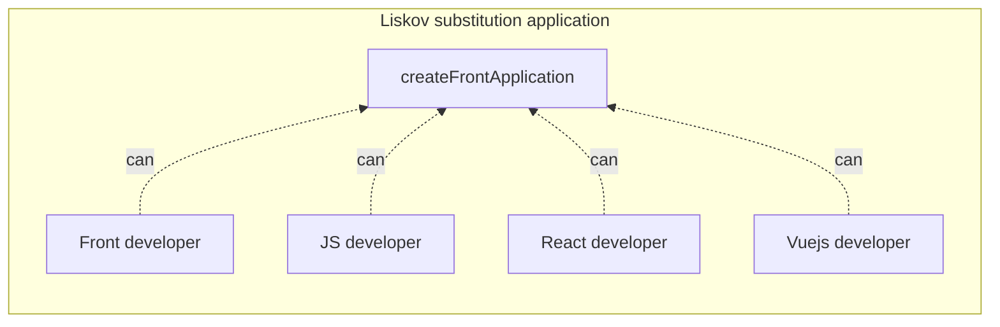

# Liskov Substitution Principle

## Introduction

The Liskov Substitution Principle (LSP) is a foundational concept in object-oriented programming and is part of the SOLID principles, a set of guidelines for good software design and architecture. Here's an overview:

### Basic Definition

Liskov Substitution Principle states that objects of a superclass should be replaceable with objects of its subclasses without affecting the functionality of the program. In simpler terms, a subclass should be substitutable for its superclass.

### Significance in Software Development

- **Promotes Consistency**: LSP ensures that a subclass behaves in a way consistent with the expectations set by its superclass. This consistency is crucial for building reliable and predictable software systems.  
- **Enhances Reusability**: By enforcing substitutability, LSP makes it easier to reuse subclasses in contexts where the superclass is expected, thereby promoting code reuse.  
- **Improves Code Robustness**: Adherence to LSP contributes to the overall robustness of the software, as it ensures that extending a class hierarchy (through inheritance) doesn’t introduce unexpected behavior or bugs.  
- **Facilitates Maintainability**: Code that adheres to LSP is generally easier to maintain, as changes to the superclass or its subclasses are less likely to require changes in dependent components.  
- **Encourages Correct Use of Inheritance**: LSP guides developers to use inheritance more appropriately and to think carefully about the relationships between parent and child classes, leading to a more logical and hierarchical object model.

### Application

- In practice, applying LSP involves ensuring that subclasses don’t override the expected behavior of their superclass. This can include maintaining invariant conditions (conditions that are always true) of the superclass, ensuring that subclass methods accept the same inputs and produce outputs of the same types, and avoiding the introduction of new exceptions or side effects not present in the superclass.

The Liskov Substitution Principle is integral to creating a well-structured, scalable, and manageable object-oriented system, emphasizing the importance of proper inheritance structures and polymorphic behavior.

## Advantages

- **Interchangeability of Subclasses**: Subclasses can be substituted for their base classes without affecting the functioning of the program.
- **Improved Robustness**: Ensures that extending classes via inheritance does not introduce unintended side effects.

## Disadvantages

- **Restrictive Design Constraints**: Can impose certain limitations on how classes and subclasses are designed, which might be viewed as overly restrictive.
- **Complexity in Subclass Design**: Requires careful design of subclasses to ensure they don't alter expected behavior, which can be challenging.

## Exemple

## Reliable Source

- **"Program Development in Java: Abstraction, Specification, and Object-Oriented Design"** by Barbara Liskov and John Guttag - Provides insights from one of the principle's namesakes.
- [Liskov Substitution Principle on Wikipedia](https://en.wikipedia.org/wiki/Liskov_substitution_principle) - A resource for understanding the basics of LSP.

## Use Cases

(Describe different scenarios where applying this principle is particularly beneficial. Include concrete examples to illustrate how and when to use this principle.)

Use Case 1: (Explanation)
Use Case 2: (Explanation)
